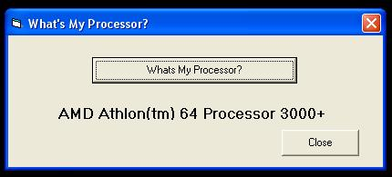



## Get The Full Name Of Your Processor

### Description

Get The Name Of Your Processor eg(AMD Athlon (tm)64 Processor 3000+) As You See It In The Control Panel-System Window. I Have Posted This Purely Because I couldn't Find The Code On PSC Any Where, Only Code That Gives You x86 N' Stuff Like That. I don't Know If It's Cheating But I Just Get It From The Registery.
 
### More Info
 
I've Only Tried This On Various Versions Of XP.

             |
---                |---
**Submitted On**   |2005-11-28 14:10:02
**By**             |[Steven Atkiss](https://github.com/Planet-Source-Code/PSCIndex/blob/master/ByAuthor/steven-atkiss.md)
**Level**          |Beginner
**User Rating**    |4.7 (14 globes from 3 users)
**Compatibility**  |VB 5\.0, VB 6\.0
**Category**       |[Windows API Call/ Explanation](https://github.com/Planet-Source-Code/PSCIndex/blob/master/ByCategory/windows-api-call-explanation__1-39.md)
**World**          |[Visual Basic](https://github.com/Planet-Source-Code/PSCIndex/blob/master/ByWorld/visual-basic.md)
**Archive File**   |[Get\_The\_Fu19517911282005\.zip](https://github.com/Planet-Source-Code/steven-atkiss-get-the-full-name-of-your-processor__1-63408/archive/master.zip)

